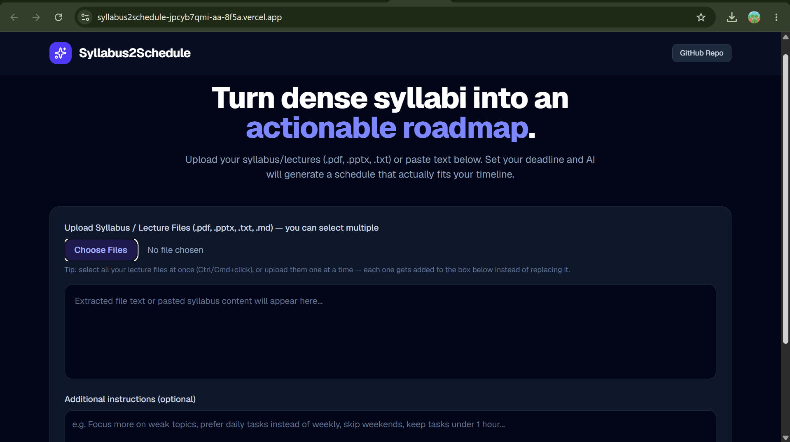
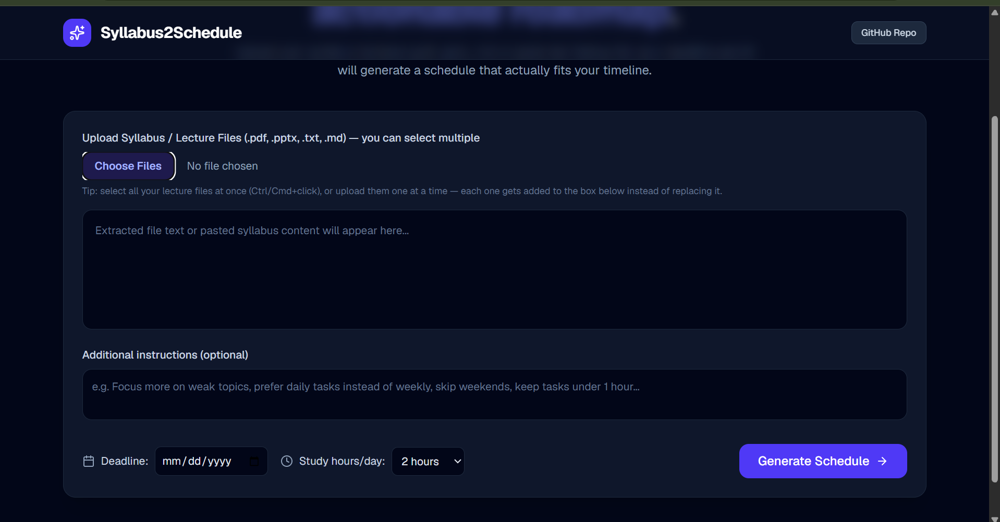
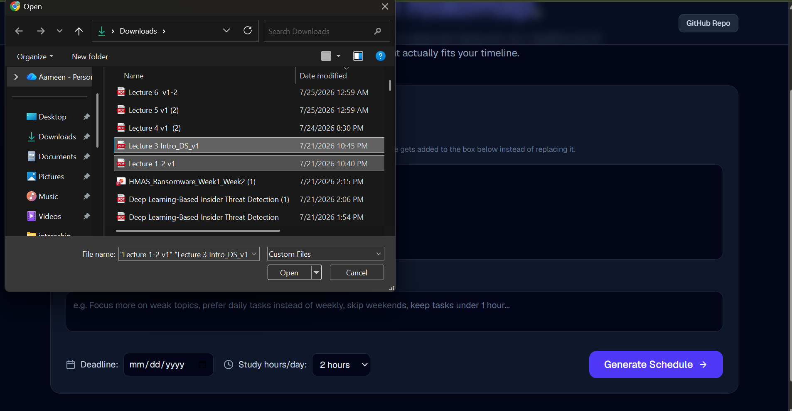
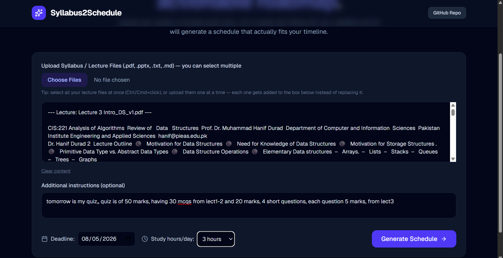
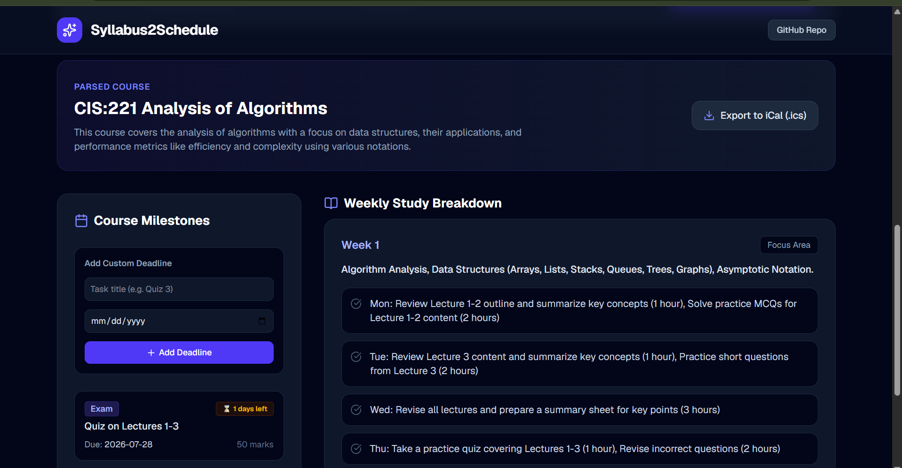
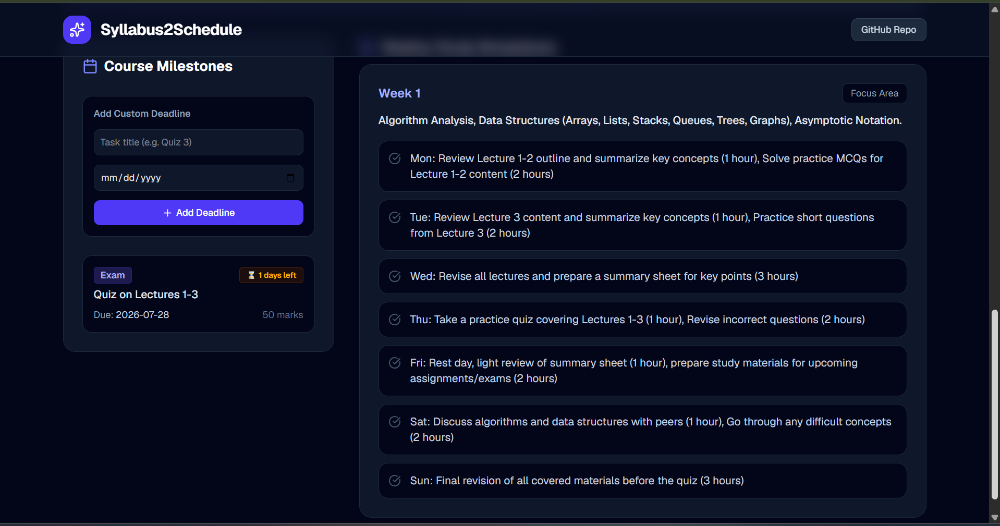

# Syllabus2Schedule

Turn a dense syllabus or lecture notes into an actionable, deadline-aware study plan — powered by AI.

**Live App:** https://syllabus2schedule-jpcyb7qmi-aa-8f5a.vercel.app/
**GitHub Repo:** https://github.com/aafatima186/syllabus2schedule

---

## a. What It Does & Who It's For

Students constantly face the same problem: a syllabus, a stack of lecture slides, and a deadline — but no clear plan for *how* to actually use the time in between. Cramming happens not because students don't care, but because turning raw course material into a realistic, day-by-day or week-by-week study plan takes effort most people don't have time for in the middle of a busy semester.

**Syllabus2Schedule** solves this by letting a student upload their syllabus and/or lecture files (PDF, PPTX, or plain text), set their real deadline, and instantly get back:
- A list of actual milestones (exams, assignments) pulled from the material
- A study plan broken into weeks — or days, if the deadline is close — that fits the *actual* time remaining
- Specific, actionable tasks for each period, tailored to how many hours per day the student can realistically study

It's built for students juggling multiple lectures/readings ahead of exams, assignments, or finals, who want a realistic plan instead of guessing how to divide their time.

---

## b. Live Deployed URL

👉 **https://syllabus2schedule-jpcyb7qmi-aa-8f5a.vercel.app/**

---

## c. Features

- **Multi-file upload** — upload multiple lecture/syllabus files (PDF, PPTX, TXT, MD) in one go; each file's text is extracted and combined automatically instead of overwriting previous uploads.
- **Deadline-aware scheduling** — the user sets their actual deadline date, and the generated plan spans exactly that window (days if the deadline is near, weeks if it's further out) instead of defaulting to a generic semester-length plan.
- **AI-generated milestones** — automatically extracts exams, assignments, and their weightage from the uploaded material, without inventing deadlines that aren't actually in the source content.
- **Custom instructions field** — users can add their own preferences (e.g. "focus more on weak topics," "prefer daily tasks," "skip weekends") which the AI applies on top of the schedule without letting it override the real dates.
- **Manual milestone entry** — users can add their own custom deadlines/tasks directly, independent of the AI-generated ones.
- **Interactive task tracking** — checkbox-style task completion for each study task, with visual strike-through for completed items.
- **Calendar export (.ics)** — download all milestones as a calendar file, each with the correct real due date, importable into Google Calendar, Outlook, Apple Calendar, etc.
- **Countdown badges** — each milestone shows days remaining (or "Today!" / "Passed") so priorities are visually obvious at a glance.

---

## d. The AI Feature

**What it does:** Given raw syllabus/lecture text, a target deadline, daily study hours, and optional user instructions, the AI feature (via OpenRouter, model `openai/gpt-4o-mini`) analyzes the material and returns a structured JSON study plan — course name, summary, milestones (with type and weightage), and a week-by-week or day-by-day task breakdown.

**The system prompt behind it:**

```
You are an expert academic advisor.

GROUND TRUTH DATES — treat these as fact, do not override them with anything
inferred from the syllabus text or user preferences below:
- Today's date: {todayStr}
- Final deadline: {deadlineDate}

Analyze the lecture/syllabus content below and output strictly a JSON object
with this exact structure:
{
  "courseName": "string",
  "summary": "string",
  "milestones": [{"id": "m1", "title": "string", "type": "Exam|Assignment", "dueDate": "YYYY-MM-DD", "weightage": "string"}],
  "studyPlan": [{"weekNumber": 1, "focusTopics": "string", "recommendedTasks": ["task1"]}]
}

STRICT RULES (these always take priority over user preferences below):
1. The study plan must span ONLY from {todayStr} to {deadlineDate}. Never
   generate more time periods than actually exist in that window.
   - If the window is 7 days or fewer, output a SINGLE studyPlan entry
     (weekNumber: 1) with a daily breakdown inside "recommendedTasks"
     (e.g. "Mon: ...", "Tue: ...").
   - If the window is longer, split into weekly chunks that fit exactly
     within it — do not pad with extra weeks.
2. Do NOT invent, assume, or add any exam/assignment/deadline not explicitly
   present in the provided lecture/syllabus content. If the only real
   deadline is the final one, output exactly one milestone using {deadlineDate}.
3. All content in "milestones" and "studyPlan" must be derived from the
   provided lecture/syllabus text — do not fabricate topics not mentioned in it.
4. Tailor tasks for {dailyHours} study hours/day.

USER PREFERENCES (apply these on top of the rules above, but never let them
change the dates or invent content not present in the source material):
{customPrompt}
```

This design deliberately puts today's date and the deadline as explicit "ground truth" facts in the prompt (rather than letting the model guess a schedule length), and separates hard rules from user preferences so custom instructions can't override the actual timeline or cause fabricated deadlines.

---

## e. Tools, Services, and AI Models Used

- **Framework:** Next.js (App Router) + TypeScript + React
- **Styling:** Tailwind CSS
- **AI Model:** `openai/gpt-4o-mini`, accessed via **OpenRouter** (`https://openrouter.ai/api/v1`)
- **AI SDK:** `openai` npm package (OpenAI-compatible client, pointed at OpenRouter's endpoint)
- **File parsing:**
  - `pdfjs-dist` — extracting text from uploaded PDF syllabi
  - `jszip` — extracting text from PPTX slide XML
- **UI:**
  - `lucide-react` — icons
  - `canvas-confetti` — celebratory animation on schedule generation
- **Hosting/Deployment:** Vercel
- **Version control:** Git + GitHub (public repository)

---

## f. Screenshots

> _Add at least 3 screenshots below before submitting — e.g. the upload form, a generated schedule with milestones + weekly/daily plan, and the custom prompt or calendar export in action._

1. 
2. 
3. 
4. 
5. 
6. 

---

## g. How to Run the Project Locally

### Prerequisites
- Node.js (v18+ recommended)
- An OpenRouter API key — get one free at [openrouter.ai](https://openrouter.ai)

### Steps

```bash
# 1. Clone the repository
git clone https://github.com/aafatima186/syllabus2schedule.git
cd syllabus2schedule

# 2. Install dependencies
npm install

# 3. Set up environment variables
# Create a .env.local file in the project root with:
OPENROUTER_API_KEY=your_openrouter_api_key_here

# 4. Run the development server
npm run dev

# 5. Open in your browser
# http://localhost:3000
```

### Environment Variables

| Variable | Description |
|---|---|
| `OPENROUTER_API_KEY` | Your API key from OpenRouter, used to call the `openai/gpt-4o-mini` model for schedule generation. Never commit this — keep it in `.env.local` (already gitignored) or your hosting provider's environment variable settings. |

---

## Notes

- No AI-generated milestone or task is fabricated beyond what's present in the uploaded material — the model is explicitly constrained against inventing deadlines.
- The schedule window always matches the real gap between today and the user's stated deadline, whether that's a single week or a full semester.